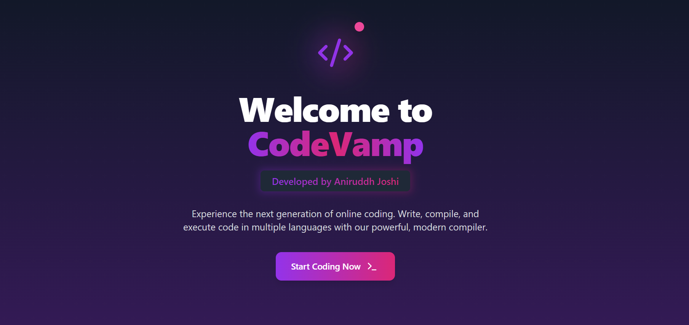
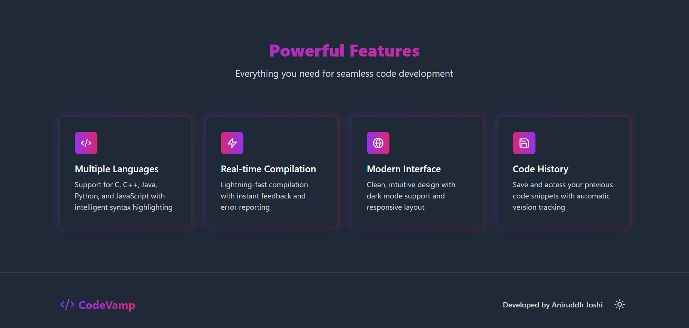
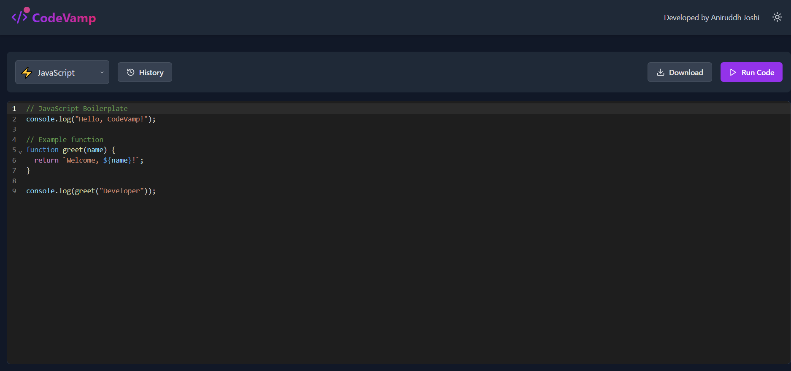

# Project-CodeVamp Compiler

🚀 **Welcome to Project-CodeVamp Compiler!** 🚀

A sleek, self-made online compiler designed to simplify and enhance your coding experience. Whether you're a beginner or an expert, this platform has you covered with its intuitive interface and powerful features. 💻✨

---

## 🌟 Features

- **Multi-language Support**: Compile and run code in various programming languages.
- **User-Friendly Interface**: Clean and intuitive design for seamless coding.
- **Fast Execution**: Get results instantly with optimized performance.
- **Accessible Anywhere**: A web-based platform available on any device.

---

## 🖼️ Screenshots

### 1. **Home Page**
A beautifully designed landing page that welcomes users to the compiler.

 

### 2. **Compiler Interface**
An intuitive editor with a console for compiling and running code.

---

## 🚀 How to Use

1. **Visit the Website**: [CodeVamp Compiler](https://codevamp-compiler.netlify.app/)
2. **Choose a Language**: Select your preferred programming language.
3. **Write Code**: Enter your code in the editor.
4. **Run Code**: Click the "Run" button to execute your code and see the results instantly.

---

## 🛠️ Tech Stack

- **Frontend**: HTML, CSS, JavaScript
- **Backend**: Node.js, Express.js
- **Compiler Engine**: Integrated with APIs for language execution
- **Hosting**: Netlify

---

## 🤝 Contributing

We welcome contributions! Feel free to fork the repository, make changes, and submit a pull request. Let’s make coding even more fun together! 🌟

---

## 📝 License

This project is licensed under the MIT License. See the [LICENSE](./LICENSE) file for details.

---

## 📬 Contact

For any inquiries or suggestions, feel free to reach out:

- **Creator**: Aniruddh Joshi
- **Email**: [YourEmail@example.com](aniruddh.joshi2904@gmail.com)
- **Website**: [CodeVamp Compiler](https://codevamp-compiler.netlify.app/)

---

💻 Happy Coding with **Project-CodeVamp Compiler**! 🚀
